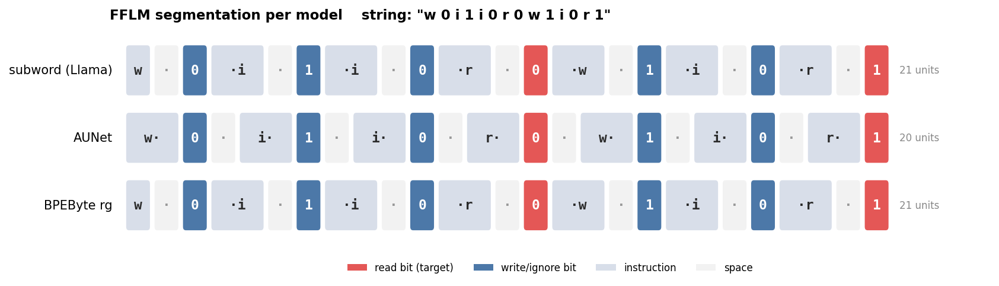
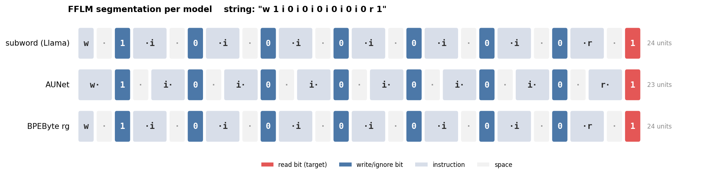

# How each model segments FFLM strings

Faithful inference-time units: subword=tiktoken BPE, AU-Net=whitespace-word
pooling (RegexPool.str_offset), byte=online greedy byte-trie
(RegexPool.online_byte_boundaries). '·' = space.

```
FFLM string : 'w 0 i 1 i 0 r 0 w 1 i 0 r 1'  (27 chars)

subword (Llama BPE)      [21 units]  'w' | '·' | '0' | '·i' | '·' | '1' | '·i' | '·' | '0' | '·r' | '·' | '0' | '·w' | '·' | '1' | '·i' | '·' | '0' | '·r' | '·' | '1'
AU-Net (word pooling)    [20 units]  'w·' | '0' | '·' | 'i·' | '1' | '·' | 'i·' | '0' | '·' | 'r·' | '0' | '·' | 'w·' | '1' | '·' | 'i·' | '0' | '·' | 'r·' | '1'
byte (greedy-root)       [21 units]  'w' | '·' | '0' | '·i' | '·' | '1' | '·i' | '·' | '0' | '·r' | '·' | '0' | '·w' | '·' | '1' | '·i' | '·' | '0' | '·r' | '·' | '1'
```

```
FFLM string : 'w 1 i 0 i 1 i 0 i 1 i 0 i 1 i 0 r 1'  (35 chars)

subword (Llama BPE)      [27 units]  'w' | '·' | '1' | '·i' | '·' | '0' | '·i' | '·' | '1' | '·i' | '·' | '0' | '·i' | '·' | '1' | '·i' | '·' | '0' | '·i' | '·' | '1' | '·i' | '·' | '0' | '·r' | '·' | '1'
AU-Net (word pooling)    [26 units]  'w·' | '1' | '·' | 'i·' | '0' | '·' | 'i·' | '1' | '·' | 'i·' | '0' | '·' | 'i·' | '1' | '·' | 'i·' | '0' | '·' | 'i·' | '1' | '·' | 'i·' | '0' | '·' | 'r·' | '1'
byte (greedy-root)       [27 units]  'w' | '·' | '1' | '·i' | '·' | '0' | '·i' | '·' | '1' | '·i' | '·' | '0' | '·i' | '·' | '1' | '·i' | '·' | '0' | '·i' | '·' | '1' | '·i' | '·' | '0' | '·r' | '·' | '1'
```

```
FFLM string : 'w 1 i 0 i 0 i 0 i 0 i 0 i 0 i 0 r 1'  (35 chars)

subword (Llama BPE)      [27 units]  'w' | '·' | '1' | '·i' | '·' | '0' | '·i' | '·' | '0' | '·i' | '·' | '0' | '·i' | '·' | '0' | '·i' | '·' | '0' | '·i' | '·' | '0' | '·i' | '·' | '0' | '·r' | '·' | '1'
AU-Net (word pooling)    [26 units]  'w·' | '1' | '·' | 'i·' | '0' | '·' | 'i·' | '0' | '·' | 'i·' | '0' | '·' | 'i·' | '0' | '·' | 'i·' | '0' | '·' | 'i·' | '0' | '·' | 'i·' | '0' | '·' | 'r·' | '1'
byte (greedy-root)       [27 units]  'w' | '·' | '1' | '·i' | '·' | '0' | '·i' | '·' | '0' | '·i' | '·' | '0' | '·i' | '·' | '0' | '·i' | '·' | '0' | '·i' | '·' | '0' | '·i' | '·' | '0' | '·r' | '·' | '1'
```

**Finding:** on FFLM all three segment to ~per-symbol granularity with each
bit as its OWN atomic unit; greedy-BPE does NOT compress even repetitive
distractor runs (unit counts 27/26/27). So the sparse-OOD gap is NOT a
tokenization/pooling-granularity effect — it is a learned long-range-attention
difference. Only the space *attachment* differs (AU-Net: [instr+space][bit];
byte/subword: [bit][space+instr]).

## Visualization

Dense example (two writes, two reads):



Sparse example (one write, long distractor run, one read) — note greedy-BPE does
NOT compress the repeated `i 0` distractors; every bit stays its own box:



Read bits (red) = prediction targets. All three keep every bit atomic and align
near-identically; only the space attaches differently (AU-Net trailing `i·`,
byte/subword leading `·i`).
