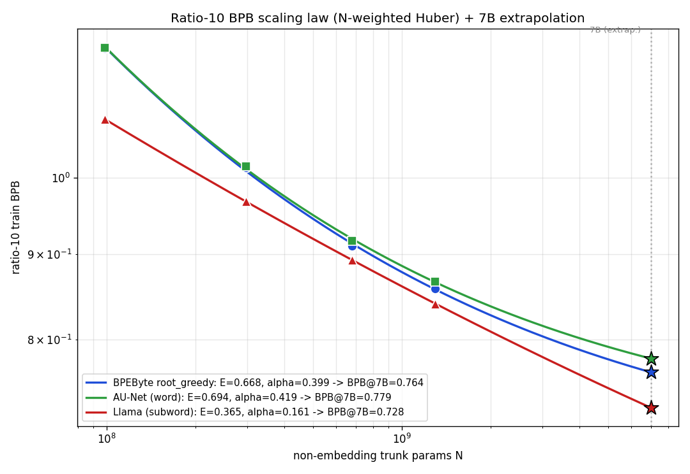
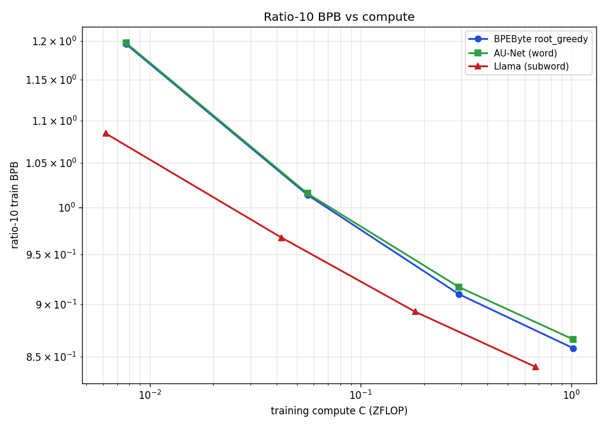
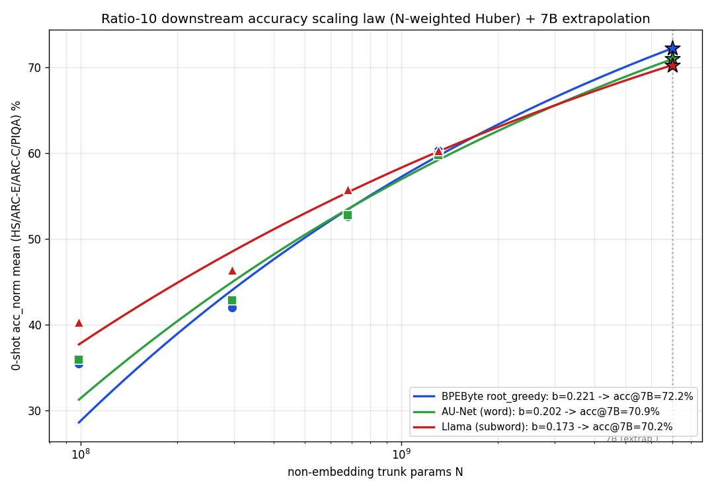

# Ratio-10 (gamma=10) scaling law — BPEByte rg vs AU-Net vs Llama

Constant data-to-model ratio gamma=10 (~46 LLaMa-tok/param), all scales. Fits are **N-weighted
Huber** (weight prop. N, so the large models anchor the extrapolation; robust to small-scale noise).
Auto-generated by `runs/plot_ratio10_ladder.py`.

## Train BPB

| scale | N | rg | AU-Net | Llama |
|---|---|---|---|---|
| 100M | 99M | 1.1958 | 1.1972 | 1.0845 |
| 300M | 296M | 1.0142 | 1.0157 | 0.9679 |
| 760M | 680M | 0.9098 | 0.9169 | 0.8926 |
| 1.3B | 1300M | 0.8578 | 0.8662 | 0.8404 |

## Downstream acc_norm (0-shot 4-bench mean)

| scale | N | rg | AU-Net | Llama |
|---|---|---|---|---|
| 100M | 99M | 35.5 | 35.9 | 40.3 |
| 300M | 296M | 42.0 | 42.9 | 46.4 |
| 760M | 680M | 52.6 | 52.8 | 55.7 |
| 1.3B | 1300M | 60.3 | 59.8 | 60.3 |

## Fitted laws (N-weighted Huber)

| model | BPB: E | alpha | R2 | acc: b | R2 |
|---|---|---|---|---|---|
| BPEByte root_greedy | 0.6676 | 0.3994 | 0.999 | 0.2211 | 0.857 |
| AU-Net (word) | 0.6943 | 0.4188 | 1.000 | 0.2019 | 0.919 |
| Llama (subword) | 0.3650 | 0.1607 | 1.000 | 0.1732 | 0.952 |

## 7B extrapolation (anchored on the large models)

| model | BPB@7B | downstream@7B |
|---|---|---|
| BPEByte root_greedy | 0.764 | 72.2% |
| AU-Net (word) | 0.779 | 70.9% |
| Llama (subword) | 0.728 | 70.2% |

**Reading it:** on BPB, Llama keeps a small edge to 7B (its low irreducible floor persists, ~0.04);
on downstream, the byte models' steeper slope carries rg slightly *ahead* of Llama by 7B. So byte-level
rg matches/overtakes subword on downstream while staying marginally behind on raw BPB.

**Caveat:** 4-point fits extrapolated 5.4x past the largest data point — the weighting anchors on the
reliable large models but cannot manufacture certainty; treat 7B as a hypothesis, not a measurement.

## Figures

- 
- 
- 
